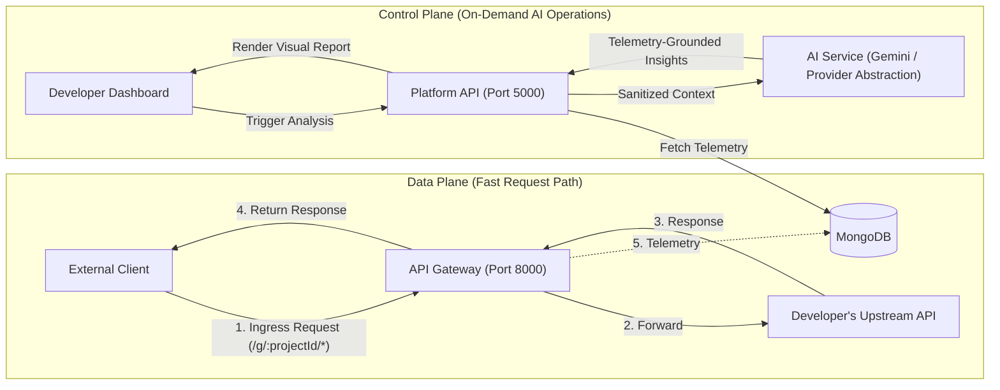

# AI GatewayOps 🚀

> **"An AI-assisted API Gateway and Developer Operations Platform for REST APIs."**

[](https://opensource.org/licenses/MIT)
[](https://nodejs.org)
[](https://reactjs.org)
[](https://mongodb.com)

---

## 1. Status & Delivery Scope

To maintain engineering clarity, all features and components are categorized into three distinct statuses:

* **[Implemented]**: Completed foundational blueprints, architecture specs, and workspace structure (Sprint 0).
* **[MVP Planned]**: Planned for implementation during the upcoming core development sprints (Sprints 1–7).
* **[Future]**: Post-MVP roadmap enhancements planned after MVP stabilization.

| Feature / Component | Status | Scope / Sprint | Description |
| :--- | :--- | :--- | :--- |
| **Architecture & Data Specifications** | `[Implemented]` | Sprint 0 | Monorepo structure, DB schemas, API contracts, AI design specs |
| **Platform Authentication (JWT)** | `[MVP Planned]` | Sprint 1 | User registration, login, and planned dual-token session architecture |
| **Project & Route Management** | `[MVP Planned]` | Sprint 2 | Project workspaces, route registry, rate limit settings, API key generation |
| **API Gateway Ingress (`/g/:projectId/*`)** | `[MVP Planned]` | Sprint 3 | Dynamic reverse proxying, in-memory rate limiting, telemetry logging |
| **Gateway Integration Testing** | `[MVP Planned]` | Sprint 4 | End-to-end proxy verification, error handling, and header forwarding tests |
| **API Observability Dashboard** | `[MVP Planned]` | Sprint 5 | React SPA for inspecting logs, status distributions, and latency metrics |
| **On-Demand AI Operations Suite** | `[MVP Planned]` | Sprint 6 | Telemetry-grounded Error Explainer, Doc Generator, and Security Analyzer |
| **Real-Time Telemetry Streaming** | `[Future]` | Post-MVP | WebSockets / SSE live stream for dashboard monitoring |
| **Distributed Rate Limiting** | `[Future]` | Post-MVP | Redis-backed sliding window for distributed gateway deployments |
| **Multi-Region Routing & Mocking** | `[Future]` | Post-MVP | Edge routing, response mocking, and additional AI model adapters |

---

## 2. Problem & Solution

### The Problem
Modern backend developers, students, and startup teams face friction managing REST APIs:
- Traditional API gateways (Kong, Apigee, AWS API Gateway) are complex, resource-heavy, and lack integrated developer intelligence.
- When an API fails with `500 Internal Server Error`, developers must manually dig through server logs and stack traces to understand the root cause.
- Writing and keeping API documentation up-to-date is time-consuming and often neglected.
- Identifying missing authentication, unvalidated payloads, or high-risk endpoints requires specialized security expertise.

### The Solution
**AI GatewayOps** is a developer-centric platform combining an API gateway, API observability, and on-demand AI operations:
1. **Developer API Gateway**: Route incoming client traffic, authenticate consumer requests via API keys, apply rate limiting, and measure round-trip latency.
2. **API Observability**: Capture telemetry, status distributions, latency metrics, and sanitized error traces.
3. **On-Demand AI Operations**: 
   - **AI Error Explainer**: Root-cause explanation and fix recommendations for 5xx failures grounded in telemetry.
   - **AI Documentation Generator**: Creates OpenAPI-ready documentation from route configurations.
   - **AI Security Analyzer**: Combines deterministic rules with LLM reasoning to flag missing auth, unvalidated routes, and traffic anomalies.

---

## 3. System Boundaries: Platform API vs. Gateway vs. Developer API

Understanding the separation of responsibilities across the three system layers is fundamental to the architecture:

```
+-----------------------------------------------------------------------------------+
|                                CLIENT APPLICATIONS                                |
|             (Web Apps, Mobile Apps, 3rd-Party API Consumers, CLI tools)           |
+------------------------------------------+----------------------------------------+
                                           |
                   [ Gateway Ingress: /g/:projectId/* ]
                   [ Header: x-api-key: gw_live_...    ]
                                           v
+-----------------------------------------------------------------------------------+
| 1. API GATEWAY (Port 8000) — DATA PLANE                                           |
|    - Intercepts external client traffic                                           |
|    - Validates consumer API Keys (ApiKey Model)                                   |
|    - Enforces rate limits per client / IP                                         |
|    - Proxies requests to Developer Upstream APIs                                  |
|    - Measures round-trip latency & records telemetry to MongoDB                   |
+------------------------------------------+----------------------------------------+
                                           |
                   [ Reverse Proxy Forwarding ]
                                           v
+-----------------------------------------------------------------------------------+
| 2. DEVELOPER API (Upstream Target API)                                            |
|    - Developer's backend service (e.g., https://api.mybiz.com/users)              |
|    - Executes actual business logic, database queries, and returns responses      |
+-----------------------------------------------------------------------------------+

+-----------------------------------------------------------------------------------+
| DEVELOPER DASHBOARD (Port 3000)                                                   |
| (React + Vite SPA used by developers to configure routes, inspect logs, run AI)   |
+------------------------------------------+----------------------------------------+
                                           |
                   [ Platform REST API: /api/*   ]
                   [ Header: Authorization: Bearer <JWT> ]
                                           v
+-----------------------------------------------------------------------------------+
| 3. PLATFORM API (Port 5000) — CONTROL PLANE                                       |
|    - Authenticates developers via JWT (User Model)                                |
|    - CRUD operations for Projects, Routes, and API Keys                           |
|    - Aggregates telemetry logs and metrics for dashboard queries                  |
|    - Coordinates on-demand AI tasks with AI Service (Gemini)                     |
+-----------------------------------------------------------------------------------+
```

### Component Distinctions
* **Platform API (Control Plane - Port 5000)**: The administrative backend for developers. Manages accounts, projects, route registries, API key issuance, telemetry querying, and triggers AI operations. Developers authenticate using **JWT access tokens**.
* **Gateway (Data Plane - Port 8000)**: The high-throughput proxy engine. Accepts incoming client traffic, resolves project routes, validates consumer **API Keys**, enforces rate limits, proxies traffic upstream, and persists telemetry logs.
* **Developer API (Upstream Target)**: The external backend services developed and hosted by developers (e.g., `https://api.mybiz.com`). The gateway transparently proxies traffic to these endpoints.

---

## 4. MVP Gateway Routing & Authentication Model

### Gateway URL Convention (MVP)
All external client requests through the Gateway follow a standardized hierarchical path:

```http
/g/:projectId/*
```

**Example:**
```http
GET http://localhost:8000/g/64abc123/api/users
Host: localhost:8000
x-api-key: gw_live_8f3a9b2c1d0e
```
* The gateway extracts `:projectId` (`64abc123`), validates the project exists and is active.
* Matches `/api/users` against the project's configured route rules.
* Forwards the request to the upstream target URL (e.g., `https://users-service.internal/api/users`).

### Authentication Model: JWT vs. API Keys

| Authentication Type | Intended Principal | Target Subsystem | Format & Header | Use Case |
| :--- | :--- | :--- | :--- | :--- |
| **JWT (Access Token)** | Developers / Platform Users | **Platform API** (Control Plane, Port 5000) | `Authorization: Bearer <jwt_token>` | Logging into dashboard, managing routes, generating API keys, viewing metrics, triggering AI operations. |
| **API Key** | External API Consumers / Apps | **Gateway** (Data Plane, Port 8000) | `x-api-key: gw_live_<hex_secret>` | Calling protected developer API endpoints through `/g/:projectId/*` to enforce project route permissions and rate limits. |

---

## 5. Product Architecture & Principles

### Critical Architectural Principle: AI is NOT in the Request Path



> [!IMPORTANT]
> **Why Telemetry Separation Matters**:
> Passing external API requests through an LLM introduces severe latency, unpredictable token costs, and availability risks. By recording telemetry during proxying and invoking AI **strictly on-demand when requested by the developer**, GatewayOps ensures a fast request path and cost-effective operations.

---

## 6. Monorepo Architecture

```
AI-GatewayOps/
├── apps/
│   ├── dashboard/         # React + Vite + Tailwind CSS developer portal
│   ├── platform-api/      # Express backend for SaaS multi-tenancy & auth
│   └── gateway/           # Express reverse proxy engine with rate limiting
│
├── services/
│   └── ai-service/        # Isolated AI provider abstraction & Gemini client
│
├── packages/
│   ├── shared/            # Common data sanitizers, logger, and utilities
│   ├── validation/        # Zod schemas for request validation
│   └── config/            # Shared configuration constants
│
├── docs/
│   ├── architecture/      # Detailed architecture & request flow specs
│   ├── api/               # Platform & Gateway REST API contracts
│   ├── database/          # Database models, schemas & index strategy
│   └── ai/                # AI system design & prompt contracts
│
├── diagrams/              # Architecture and ERD diagrams
├── scripts/               # Developer helper and seeding scripts
├── .env.example           # Environment variable template
├── package.json           # Monorepo root workspace configuration
└── README.md
```

---

## 7. Key Technology Stack

| Layer | Technologies | Purpose |
| :--- | :--- | :--- |
| **Frontend** | React, Vite, Tailwind CSS, React Router, TanStack Query, Recharts | Fast, responsive developer dashboard |
| **Backend (Platform API)** | Node.js, Express, Mongoose, Zod, bcrypt, JWT | Multi-tenant SaaS management, auth & telemetry aggregation |
| **Data Plane (Gateway)** | Node.js, Express, http-proxy-middleware (or native streaming HTTP proxy) | Dynamic route resolution, rate limiting, and reverse proxying |
| **Database** | MongoDB (with Mongoose ORM & TTL indexes) | Document storage for users, projects, routes, and logs |
| **AI Subsystem** | Google Gemini API via Provider Abstraction (`IAIProvider`) | Telemetry-grounded error analysis, documentation, and security audits |

---

## 8. Incremental Build Roadmap (Sprints)

- [x] **Sprint 0: Architecture & Foundation Blueprint** `[Implemented]`
  - Monorepo setup, database schemas, API specs, AI architecture docs, and design review.
- [ ] **Sprint 1: Backend Foundation & Platform Auth** `[MVP Planned]`
  - MongoDB connection, User model, Registration, Login, password hashing with bcrypt, and planned dual-token session architecture.
- [ ] **Sprint 2: Projects & Route Configuration** `[MVP Planned]`
  - Project workspaces, API route registry, API key generation (`gw_live_...`), Zod validation schemas.
- [ ] **Sprint 3: API Gateway & Telemetry Ingress** `[MVP Planned]`
  - Ingress route parsing (`/g/:projectId/*`), dynamic reverse proxying, in-memory rate limiting, header sanitization, telemetry capture.
- [ ] **Sprint 4: Gateway Integration Testing & Proxy Verification** `[MVP Planned]`
  - Integration tests for route resolution, upstream error handling (502/504 simulation), header preservation, rate limiting accuracy, and telemetry persistence.
- [ ] **Sprint 5: Observability Dashboard** `[MVP Planned]`
  - React + Vite SPA, analytics charts (Recharts), request log inspector, route management UI.
- [ ] **Sprint 6: AI Operations Suite** `[MVP Planned]`
  - `IAIProvider` interface, Gemini adapter, Error Explainer, Documentation Generator, Rule-Assisted Security Audit.
- [ ] **Sprint 7: Production Hardening & Deployment** `[MVP Planned]`
  - End-to-end testing, error boundary hardening, security audit review, and deployment guides.

---

## 9. Non-Goals for MVP

To ensure high quality and timely delivery of core capabilities, the following areas are explicit non-goals for the MVP release:

1. **Real-Time Log Streaming via WebSockets / SSE**: The MVP dashboard will provide query-based and polling-based log inspection rather than persistent bidirectional socket streams.
2. **Distributed Rate Limiting with Redis**: The MVP gateway uses an in-memory sliding/fixed window rate limiter suited for single-instance deployment without requiring external Redis infrastructure.
3. **Inline AI Inspection**: AI is never in the live request path; synchronous LLM analysis of active traffic is out of scope.
4. **Multi-Region Gateway Deployment & Edge Mesh**: Multi-region routing and edge data plane coordination are post-MVP architecture goals.
5. **API Monetization & Billing**: Usage-based billing, payment gateways (Stripe), and subscription enforcement are deferred.
6. **Automatic Upstream Payload Transformation / Mocking**: The gateway focuses on transparent proxying without arbitrary body transformations or mock responder modes in MVP.

---

## 10. Future Roadmap

Post-MVP releases will build on the validated foundation with the following planned capabilities:

* **Distributed Rate Limiting & Shared Cache**: Redis-backed rate limiting and route configuration caching for multi-node gateway scaling.
* **Real-Time Telemetry Streaming**: WebSockets and Server-Sent Events (SSE) for live-tailing logs directly within the developer dashboard.
* **Expanded AI Provider Support**: Adapters for Anthropic Claude, OpenAI, and self-hosted local models (Ollama / vLLM).
* **Automated Mock Server**: Ability to simulate upstream endpoints directly from generated OpenAPI specifications.
* **Custom Middleware Plugins**: WebAssembly (Wasm) and JavaScript plugin hooks for custom header and request enrichment.
* **Automated Anomaly Detection**: Proactive heuristic and statistical alerts for unexpected traffic surges and error spikes.

---

## 11. Security, Privacy & AI Analysis Principles

1. **Sensitive Data Protection**: Passwords, JWTs, bearer tokens, API keys, and authorization headers are scrubbed via a sanitization pipeline before persisting telemetry and before constructing prompts for AI providers.
2. **Dual-Token Authentication (Planned Architecture)**: Platform authentication is designed with short-lived JWT access tokens paired with rotated refresh tokens stored using cryptographic hashing in MongoDB (scheduled for Sprint 1).
3. **Telemetry-Grounded AI Analysis**: AI analysis is grounded in supplied telemetry and source context, structured to explicitly distinguish observed evidence from inferences and recommendations with confidence scoring.

---

## 12. Local Development Quickstart

### Prerequisites
- Node.js 18+
- MongoDB instance (local or MongoDB Atlas connection string)
- Gemini API Key (free tier from [Google AI Studio](https://aistudio.google.com/))

### Setup
```bash
# 1. Clone repository & install dependencies
git clone https://github.com/your-username/ai-gatewayops.git
cd ai-gatewayops
npm install

# 2. Configure environment
cp .env.example .env
# Edit .env with your MONGODB_URI and GEMINI_API_KEY

# 3. Start Platform API (Control Plane)
npm run dev:platform
# Health Check: http://localhost:5000/api/health
```
