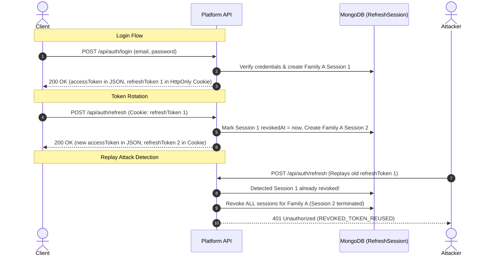

# AI GatewayOps — Platform API (Control Plane)

The **Platform API** is the control plane backend for AI GatewayOps. It is responsible for managing the SaaS platform (user accounts, projects, route registries, API key issuance, and telemetry aggregation).

> [!NOTE]
> The Platform API is **NOT** the data plane reverse proxy. API consumer traffic is handled separately by the Gateway service (`apps/gateway`).

---

## Directory Structure

```
apps/platform-api/
├── src/
│   ├── config/
│   │   ├── db.js                # MongoDB Mongoose connection & lifecycle
│   │   └── env.js               # Environment variables parsing & validation
│   ├── controllers/
│   │   ├── auth.controller.js   # Authentication endpoints (register, login, refresh, logout, me)
│   │   └── health.controller.js # Health / liveness check controller
│   ├── middleware/
│   │   ├── authenticate.js      # JWT Bearer token authentication middleware
│   │   ├── authorize.js         # Role-based access control middleware
│   │   ├── errorHandler.js      # Centralized error handler
│   │   └── notFoundHandler.js   # 404 handler for unmatched routes
│   ├── models/
│   │   ├── RefreshSession.js    # Hashed refresh session schema with family tracking & TTL
│   │   └── User.js              # User account schema with bcrypt password hashing
│   ├── routes/
│   │   ├── auth.routes.js       # Authentication routes (/api/auth/*)
│   │   ├── health.routes.js     # Health route definition (/api/health)
│   │   └── index.js             # API route aggregator mounted at /api
│   ├── services/
│   │   └── auth.service.js      # Core authentication business logic & token rotation
│   ├── utils/
│   │   ├── ApiError.js          # Standardized operational error class
│   │   └── token.utils.js       # JWT signing/verification & crypto token hashing
│   ├── app.js                   # Express application setup & middleware stack
│   └── server.js                # HTTP server bootstrap & graceful shutdown
├── package.json
└── README.md
```

---

## Required Environment Variables

Configure these in the repository root `.env` file (copied from `.env.example`):

| Variable | Default | Required in Production | Description |
| :--- | :--- | :--- | :--- |
| `NODE_ENV` | `development` | Yes | Runtime environment (`development`, `production`, `test`) |
| `PORT` or `PLATFORM_PORT` | `5000` | No | HTTP port the Platform API listens on |
| `MONGODB_URI` | `mongodb://localhost:27017/ai_gatewayops` | Yes | MongoDB connection string |
| `CORS_ORIGIN` | `http://localhost:5173` | Yes | Allowed CORS origins (comma-separated or single) |
| `JWT_ACCESS_SECRET` | Dev fallback string | **YES (Strict)** | Secret key used to sign and verify short-lived access JWTs (min 32 chars) |
| `JWT_ACCESS_EXPIRES_IN` | `15m` | No | Access token expiration duration (e.g., `15m`) |
| `JWT_REFRESH_EXPIRES_IN` | `7d` | No | Refresh token expiration duration (e.g., `7d`) |
| `REFRESH_COOKIE_NAME` | `refreshToken` | No | Name of the HttpOnly cookie for refresh tokens |
| `REFRESH_COOKIE_PATH` | `/api/auth` | No | Cookie path scope for the refresh token cookie |

> [!CAUTION]
> In production environments (`NODE_ENV=production`), `JWT_ACCESS_SECRET` must be explicitly defined. The application will immediately throw a fatal error on startup if `JWT_ACCESS_SECRET` is missing.

---

## Authentication Architecture (Sprint 1B)

### 1. Access Token vs. Refresh Token

| Dimension | Access Token (JWT) | Refresh Token (Opaque String) |
| :--- | :--- | :--- |
| **Format** | Signed JSON Web Token (JWT) | Cryptographically secure random hex string |
| **Lifetime** | Short-lived (`15m`) | Longer-lived (`7d`) |
| **Delivery** | JSON response body (`accessToken`) | Secure `HttpOnly`, `SameSite=Lax` Cookie (`refreshToken`) |
| **Client Storage** | In-memory (state / memory store) | Browser Cookie Storage (protected against XSS) |
| **Usage** | `Authorization: Bearer <token>` | `POST /api/auth/refresh` |
| **Statefulness** | Stateless (verified via cryptographic signature) | Stateful (validated against database `RefreshSession`) |

### 2. Cryptographic Token & Password Storage
- **Passwords**: Never stored in plaintext. Hashed using `bcrypt` (10 salt rounds). Schema automatically suppresses `passwordHash` in JSON serialization and default queries.
- **Refresh Tokens**: Opaque raw tokens are **never stored** in the database. When issued, the token is hashed using SHA-256 (`tokenHash`), and only the cryptographic hash is stored in MongoDB.
- **Access Tokens**: Not stored in MongoDB at all; verified statelessly via signature.

### 3. Refresh-Token Rotation & Token Family Reuse Detection
Every time an access token is refreshed via `POST /api/auth/refresh`:
1. The incoming refresh token is verified against MongoDB by its SHA-256 hash.
2. **Reuse Detection (Token Family)**: If the token has already been marked as `revoked` (indicating a potential token replay or compromise), the system immediately revokes **all active sessions** associated with that `familyId` and returns `401 REVOKED_TOKEN_REUSED`.
3. If valid, the current refresh token is marked revoked (`revokedAt = Date.now()`).
4. A brand new opaque refresh token is generated and stored in a new `RefreshSession` maintaining the same `familyId`.
5. A new access token is signed and returned in JSON, while the new refresh token is set in the `HttpOnly` cookie.



### 4. Logout Behavior
- `POST /api/auth/logout`: Revokes **only the specific refresh session** associated with the current device's cookie/token (`revokedAt = Date.now()`) and clears the cookie.
- Unrelated active sessions on other devices (with different token hashes/families) remain active.

### 5. HTTP 401 Unauthorized vs. HTTP 403 Forbidden
- **401 Unauthorized (`UNAUTHORIZED`, `TOKEN_EXPIRED`, `INVALID_TOKEN`, `INVALID_CREDENTIALS`)**: The client is unauthenticated, the token is missing, expired, or malformed, or credentials were invalid.
- **403 Forbidden (`FORBIDDEN`)**: The client is successfully authenticated, but lacks the necessary permissions/role (e.g. non-admin attempting admin operations).

---

## Authentication Endpoints

### 1. Register
- **Method / Path**: `POST /api/auth/register`
- **Request Body**:
```json
{
  "email": "developer@example.com",
  "password": "SecurePassword123!",
  "fullName": "Jane Developer",
  "role": "developer"
}
```
- **Response (`201 Created`)**:
```json
{
  "success": true,
  "data": {
    "user": {
      "id": "64f1a2...",
      "email": "developer@example.com",
      "fullName": "Jane Developer",
      "role": "developer",
      "isActive": true,
      "createdAt": "2026-08-27T00:00:00.000Z",
      "updatedAt": "2026-08-27T00:00:00.000Z"
    }
  }
}
```

### 2. Login
- **Method / Path**: `POST /api/auth/login`
- **Request Body**:
```json
{
  "email": "developer@example.com",
  "password": "SecurePassword123!"
}
```
- **Response (`200 OK`)**:
  - `Set-Cookie`: `refreshToken=<opaque_token>; Path=/api/auth; HttpOnly; SameSite=Lax`
```json
{
  "success": true,
  "data": {
    "user": {
      "id": "64f1a2...",
      "email": "developer@example.com",
      "fullName": "Jane Developer",
      "role": "developer",
      "isActive": true
    },
    "accessToken": "eyJhbGciOi..."
  }
}
```

### 3. Refresh Access Token
- **Method / Path**: `POST /api/auth/refresh`
- **Header**: Cookie `refreshToken=<opaque_token>`
- **Response (`200 OK`)**:
  - `Set-Cookie`: `refreshToken=<new_rotated_opaque_token>; Path=/api/auth; HttpOnly; SameSite=Lax`
```json
{
  "success": true,
  "data": {
    "user": {
      "id": "64f1a2...",
      "email": "developer@example.com",
      "role": "developer"
    },
    "accessToken": "eyJhbGciOi..."
  }
}
```

### 4. Logout
- **Method / Path**: `POST /api/auth/logout`
- **Header**: Cookie `refreshToken=<opaque_token>`
- **Response (`200 OK`)**:
  - `Set-Cookie`: `refreshToken=; Path=/api/auth; Expires=Thu, 01 Jan 1970 00:00:00 GMT`
```json
{
  "success": true,
  "message": "Successfully logged out."
}
```

### 5. Protected Profile (Me)
- **Method / Path**: `GET /api/auth/me`
- **Header**: `Authorization: Bearer <accessToken>`
- **Response (`200 OK`)**:
```json
{
  "success": true,
  "data": {
    "user": {
      "id": "64f1a2...",
      "email": "developer@example.com",
      "role": "developer"
    }
  }
}
```

---

## Running & Testing

### Running the Platform API
```bash
# From workspace root:
npm run dev:platform
```

### Health Check (Liveness)
- **Endpoint**: `GET /api/health`
- **Response**:
```json
{
  "success": true,
  "message": "AI GatewayOps Platform API is running"
}
```
