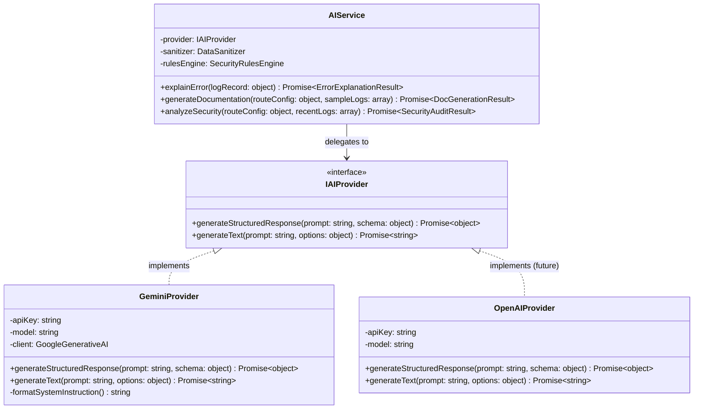
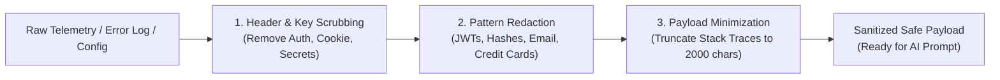

# AI Subsystem Architecture & Provider Abstraction — AI GatewayOps

## 1. Core Principles & Philosophy

The AI subsystem in **AI GatewayOps** is designed around four non-negotiable principles:

1. **Telemetry Separation (Fast Request Path)**: AI is an administrative and analytical tool, never a synchronous hop in external client traffic.
2. **Provider Agnosticism**: All AI features interact with an abstracted provider contract (`IAIProvider`). The primary engine is Google Gemini (`@google/genai` or `@google/generative-ai`), but adapters for OpenAI, Anthropic, or local models can be added with zero changes to core business logic.
3. **Deterministic Rules First**: AI never guesses when deterministic rules can establish facts. Static security pattern detectors and regex linters run before prompt synthesis.
4. **Sensitive Data Protection**: Raw request/response data is sanitized to eliminate passwords, JWTs, bearer tokens, API keys, cookies, and PII prior to calling the LLM.
5. **Telemetry-Grounded Analysis**: AI operations are grounded in supplied telemetry and source context, structured to explicitly distinguish observed evidence from inferences and recommendations.

---

## 2. AI Provider Architecture & Class Hierarchy



---

## 3. Data Sanitization & Secret Redaction Pipeline

Before any prompt is compiled, `DataSanitizer` runs a multi-stage redaction pass:



### Redaction Rules:
- **Keys scrubbed**: `authorization`, `cookie`, `set-cookie`, `x-api-key`, `password`, `token`, `secret`, `access_token`, `refresh_token`.
- **JWT Pattern**: `eyJ[A-Za-z0-9-_=]+\.[A-Za-z0-9-_=]+\.?[A-Za-z0-9-_.+/=]*` $\rightarrow$ `[REDACTED_JWT]`
- **Bearer Tokens**: `Bearer\s+[A-Za-z0-9\-._~+/]+=*` $\rightarrow$ `Bearer [REDACTED_TOKEN]`
- **API Key Patterns**: `(gw_live_|sk_|key_)[A-Za-z0-9]{16,}` $\rightarrow$ `[REDACTED_KEY]`

---

## 4. AI Feature Specifications

### Feature 1: AI Error Explainer (`/api/ai/error-analysis`)
* **Trigger**: Developer clicks **"Explain Error"** on a 500/502/504 log entry in the dashboard.
* **Input to AI**: Sanitized HTTP method, endpoint, status code, error message, truncated stack trace, and upstream route definition.
* **Prompt Contract & Grounded Output (Zod Schema)**:
  ```json
  {
    "summary": "Short 1-2 sentence human description of the error",
    "likelyRootCause": "Detailed technical hypothesis",
    "observedEvidence": ["Exact evidence point 1 from stack trace", "Exact evidence point 2 from HTTP status"],
    "inferredConclusions": ["Inference regarding upstream service state"],
    "suggestedFix": "Concrete code or configuration change",
    "prevention": "Architectural or operational safeguard to prevent recurrence",
    "confidence": 0.95
  }
  ```

---

## Feature 2: AI Documentation Generator (`/api/ai/documentation`)
* **Trigger**: Developer clicks **"Generate Docs"** on any registered route.
* **Input to AI**: Route metadata (path, methods, query parameters observed in telemetry, sample request/response shapes).
* **OpenAPI-Compatible Structured Output**:
  ```json
  {
    "endpoint": "/g/64abc123/api/v1/products",
    "method": "GET",
    "summary": "Retrieve catalog of products with pagination",
    "description": "Returns a paginated list of available store products with inventory status.",
    "authRequired": true,
    "pathParameters": [],
    "queryParameters": [
      { "name": "limit", "type": "integer", "required": false, "description": "Max results to return (default 20)" }
    ],
    "headers": [
      { "name": "x-api-key", "required": true, "description": "Client Gateway API Key" }
    ],
    "requestBody": null,
    "responses": {
      "200": { "description": "List of products", "schema": { "type": "array" } },
      "401": { "description": "Missing or invalid API key" }
    },
    "exampleRequest": "curl -X GET 'http://localhost:8000/g/64abc123/api/v1/products?limit=10' -H 'x-api-key: gw_live_...'",
    "exampleResponse": { "products": [{ "id": "p1", "name": "Widget" }] }
  }
  ```

---

## Feature 3: AI Security Analyzer (`/api/ai/security-analysis`)
* **Deterministic Pre-Engine**:
  1. Checks for unauthenticated sensitive routes (`/admin`, `/users`, `/payments` with `authRequired: false`).
  2. Scans recent error logs for SQL injection (`UNION SELECT`), XSS (`<script>`), and directory traversal (`../`) strings in query params.
  3. Checks for missing rate limits or overly permissive configurations.
* **AI Evaluation**: The LLM consumes the route configuration and rule flags to produce categorized findings, explicitly distinguishing confirmed rule violations from contextual inferences.
* **Finding Categories**:
  - `CONFIRMED_ISSUE`: Deterministically proven configuration rule violation (e.g., exposed admin endpoint with no auth).
  - `STRONG_INDICATION`: High likelihood risk identified from telemetry patterns (e.g., stack trace leaking internal DB hostnames).
  - `POSSIBLE_ISSUE`: Best-practice advisory or inference (e.g., missing payload validation schema).
* **Structured Output**:
  ```json
  {
    "findings": [
      {
        "category": "CONFIRMED_ISSUE",
        "severity": "HIGH",
        "title": "Unprotected Administrative Endpoint",
        "evidence": "Route /admin/metrics has authRequired=false",
        "inference": "External actors can access system operational stats without credentials.",
        "remediation": "Enable authRequired on the route and assign an API key policy."
      }
    ]
  }
  ```
