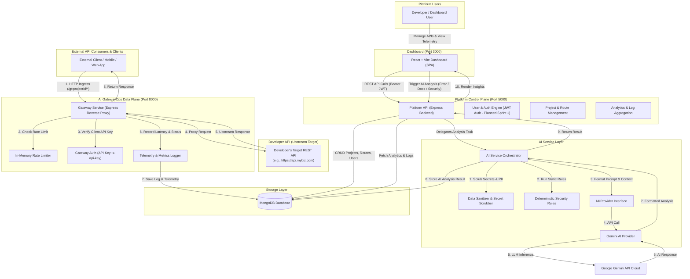

# System Architecture Overview — AI GatewayOps

## 1. System Vision & Positioning

**AI GatewayOps** is a developer-focused platform combining:
1. **API Gateway & Reverse Proxying**: Dynamic routing, API key validation for API consumers, in-memory rate limiting, and transparent reverse proxying to upstream developer REST APIs.
2. **Telemetry & API Observability**: Ingress logging of HTTP methods, paths, status codes, round-trip latency timings, headers, and error traces.
3. **On-Demand AI Operations**: An isolated AI layer powered by Google Gemini (via an abstracted provider interface `IAIProvider`) offering automated Error Explanation, OpenAPI-ready Documentation Generation, and Rule-Assisted Security Audits grounded in telemetry.

> [!IMPORTANT]
> **Core Architectural Principle**: **AI is NEVER in the critical request path.** 
> Telemetry collection happens during request proxying without inline LLM overhead. AI operations are executed strictly on-demand when triggered by developers from the Dashboard.

---

## 2. High-Level Architecture Diagram

---

## 3. Subsystem Breakdown & Responsibilities

### A. Data Plane: `apps/gateway` (Port 8000)
* **Purpose**: High-throughput, low-overhead HTTP reverse proxying engine for external API consumers.
* **Core Responsibilities**:
  - Ingress URL parsing: `/g/:projectId/*` (e.g. `/g/64abc123/api/users`).
  - Route lookup: Resolves target upstream URI and route policy from in-memory cache / database.
  - Policy enforcement: In-memory rate limiting per IP/API Key, CORS headers, client API Key validation (`x-api-key`).
  - Streaming reverse proxy: Transparently forwards method, headers, query params, and body using `http-proxy-middleware` (or native streaming HTTP proxy).
  - Telemetry capture: Computes round-trip latency (`process.hrtime`), status code, and writes sanitized telemetry records to MongoDB.

### B. Control Plane: `apps/platform-api` (Port 5000)
* **Purpose**: Multi-tenant management API for developers.
* **Core Responsibilities**:
  - Developer identity & authentication: User registration, login, password hashing (bcrypt), and planned dual-token JWT lifecycle (short-lived access + rotated refresh tokens for Sprint 1).
  - Project & Route configuration: CRUD operations for project workspaces, API routing rules, rate limit thresholds, and API keys.
  - Telemetry aggregation: Endpoints to query request volumes, error rates (4xx/5xx), latency metrics, and detailed log inspection.
  - AI dispatch coordinator: Validates developer permissions and dispatches analysis requests to the AI Service.

### C. Presentation Layer: `apps/dashboard` (Port 3000)
* **Purpose**: Single Page Application (SPA) built with React, Vite, and Tailwind CSS.
* **Core Responsibilities**:
  - Project configuration UI (register endpoints, assign upstream URLs, issue API keys).
  - API observability UI (latency graphs, status distribution via Recharts, request log inspector).
  - Interactive AI workspace: 
    - **"Explain Error"**: One-click root-cause analysis on 5xx log entries grounded in telemetry.
    - **"Generate Docs"**: Auto-generates endpoint specs, headers, schemas, and example payloads.
    - **"Security Audit"**: Scans endpoint configurations and traffic patterns for potential vulnerabilities.

### D. Intelligence Engine: `services/ai-service`
* **Purpose**: Isolated AI orchestrator decoupling LLM integration from core services.
* **Core Responsibilities**:
  - Sensitive Data Protection pipeline: Redacts Authorization headers, API keys, passwords, bearer tokens, and PII before constructing prompts.
  - Deterministic pre-checks: Static rules scan for common patterns (e.g., missing auth headers, injection signatures) prior to LLM reasoning.
  - `IAIProvider` interface: Contract separating business logic from LLM SDKs (Google Gemini adapter initially, swappable for OpenAI/Anthropic).
  - Grounded output structuring: Enforces strict JSON schemas via Zod, requiring the model to distinguish observed telemetry evidence from inferences.

---

## 4. Architectural Trade-offs & Design Decisions

| Decision | Chosen Approach | Alternative Considered | Rationale & Trade-off |
| :--- | :--- | :--- | :--- |
| **Telemetry vs AI Path** | Telemetry recorded to DB; AI triggered on-demand via Dashboard | Inline AI inspection (Proxying every request through LLM) | Inline AI adds substantial latency, high token costs, and availability risks. On-demand AI keeps the gateway on a fast request path without LLM latency overhead. |
| **Monorepo Layout** | npm workspaces (`apps/*`, `services/*`, `packages/*`) | Polyrepo (separate Git repos) | Single repository simplifies coordinated changes across Gateway, Platform API, and Shared types while maintaining independent deployment boundaries. |
| **Rate Limiting** | In-memory token bucket / sliding window | Distributed Redis rate limiting | Fits constrained development environments without requiring external Redis instances for MVP. Redis upgrade is planned for post-MVP. |
| **Gateway Separation** | Standalone Express service (`gateway`) | Embedded routes inside Platform API | Decouples customer API traffic from administrative dashboard operations, preventing dashboard loads from starving gateway proxying resources. |
| **AI Decoupling** | Provider Adapter Pattern (`IAIProvider`) | Direct SDK calls in Platform controllers | Prevents vendor lock-in. Switching across Gemini, Anthropic, or local Ollama requires updating only the adapter. |

---

## 5. Security & Isolation Boundaries

1. **Sensitive Data Protection**: All raw headers, cookies, request bodies, and sensitive tokens pass through a mandatory Redaction Filter (`packages/shared/sanitizer.js`) before telemetry storage and before prompt synthesis.
2. **Dual-Token Authentication (Planned Architecture)**: Platform API authentication is designed around short-lived JWT access tokens paired with long-lived, cryptographically hashed refresh tokens stored in MongoDB (Sprint 1 planned).
3. **Gateway Tenant Isolation**: Gateway paths require explicit project routing identifiers (`/g/:projectId/*`), preventing cross-tenant data access or telemetry confusion.

