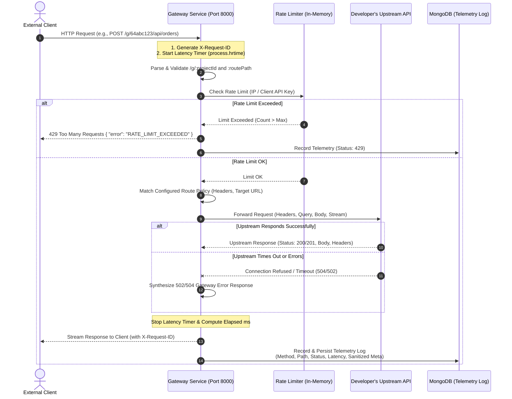
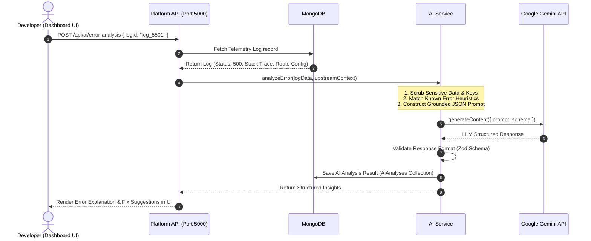

# Request Lifecycle & Telemetry Flow — AI GatewayOps

## 1. Overview

This document specifies the exact end-to-end lifecycle of an HTTP request passing through **AI GatewayOps**. It details both the **Data Plane (API Gateway Request Flow)** and the separate **Control Plane (On-Demand AI Analysis Flow)**.

---

## 2. Gateway Request Flow (Data Plane)

### Sequence Diagram



---

## 3. Step-by-Step Gateway Processing Pipeline

### Step 1: Ingress & Correlation ID Generation
* When an HTTP request enters the Gateway (`apps/gateway`), the `correlationIdMiddleware` assigns a unique UUID:
  ```http
  X-Request-Id: req_9a8b7c6d-5e4f-3a2b-1c0d-e9f8a7b6c5d4
  ```
* A high-resolution timer (`process.hrtime.bigint()`) starts immediately to measure real gateway-to-client round-trip duration.

### Step 2: Route & Project Resolution
* Gateway routes are structured hierarchically: `/g/:projectId/*`
  - **Example**: `GET /g/64abc123/api/users`
* The Gateway extracts `:projectId` (`64abc123`) and queries the route registry (cached in memory, populated from MongoDB).
* If `:projectId` does not exist $\rightarrow$ Returns `404 Not Found` (`PROJECT_NOT_FOUND`).
* The remaining URL path (`/api/users`) is matched against active routes configured for that project (e.g. matching `/api/users` against target `https://users-service.internal/api/users`).
* If no route matches $\rightarrow$ Returns `404 Not Found` (`ROUTE_NOT_FOUND`).

### Step 3: Rate Limiting Enforcement
* An in-memory Sliding/Fixed Window rate limiter checks the client identifier (Client IP address or API Key header `x-api-key`).
* If the request exceeds the configured threshold (e.g., > 100 req/60s):
  - Ingress halts immediately.
  - Gateway responds with `429 Too Many Requests` with headers:
    ```http
    Retry-After: 42
    X-RateLimit-Limit: 100
    X-RateLimit-Remaining: 0
    ```
  - Telemetry record with status `429` is logged.

### Step 4: Request Forwarding & Reverse Proxying
* The gateway rewrites headers:
  - Preserves client `Content-Type`, `Accept`, and query parameters.
  - Appends `X-Forwarded-For`, `X-Forwarded-Proto`, and `X-Gateway-Request-ID`.
  - Removes hop-by-hop headers (`Connection`, `Keep-Alive`, `Transfer-Encoding`).
* Proxies the payload to the developer's registered upstream endpoint with a configurable timeout (e.g., 10,000 ms).

### Step 5: Upstream Response & Error Handling
* **Scenario A (Success / Normal 4xx / 5xx from Upstream)**: The upstream returns its standard HTTP status code and response body. The gateway relays the status and response directly to the client.
* **Scenario B (Upstream Timeout / Network Failure)**: If the upstream fails to connect or exceeds the 10-second timeout, the gateway intercepts the socket error and returns:
  ```json
  {
    "statusCode": 504,
    "errorCode": "UPSTREAM_GATEWAY_TIMEOUT",
    "message": "The upstream developer API did not respond within the allowed timeout period.",
    "requestId": "req_9a8b7c6d-..."
  }
  ```

### Step 6: Telemetry Recording & Persistence
* The timer calculates elapsed latency in milliseconds (e.g., `43.8 ms`).
* Telemetry record is compiled:
  - `projectId`, `routeId`
  - `method`, `path`, `statusCode`, `latencyMs`
  - `userAgent`, sanitized client IP (hashed/masked for privacy)
  - `errorDetails` (only present if 4xx/5xx occurred)
* The telemetry record is stored in MongoDB `Logs` collection.
* **Sensitive Data Protection Policy**: Passwords, `Authorization` headers, `Cookie` headers, and sensitive tokens are strictly scrubbed before saving.

---

## 4. On-Demand AI Operations Flow (Control Plane)



### Key Principles of AI Processing:
1. **Zero Impact on Active Traffic**: Developers inspect issues after they occur. No external API caller ever waits on an LLM inference cycle.
2. **Deterministic Pre-Filtering**: Before querying Gemini, the AI service runs regex and rule-based heuristics to identify deterministic errors (e.g., ECONNREFUSED, invalid JSON format, DNS lookup failures).
3. **Telemetry-Grounded Analysis**: AI analysis is strictly grounded in the supplied telemetry and source context, structured to explicitly distinguish observed evidence from inferences and recommendations.

