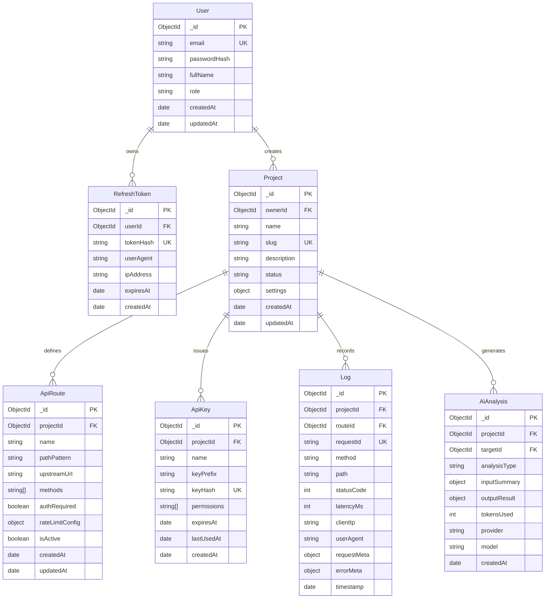

# Database Schema & Data Models Specification — AI GatewayOps

## 1. Overview & Database Architecture

AI GatewayOps uses **MongoDB** as its primary document database via **Mongoose**. 

### Key Design Principles:
1. **Normalized Relationships with Strategic Embedding**: Multi-tenant entities (`Projects`, `ApiRoutes`, `ApiKeys`) are linked via `ObjectId` references. Sub-documents are used for localized configuration settings (e.g., rate limit options).
2. **High-Performance Query Indexing**: Critical access paths (such as route lookups during gateway ingress, telemetry lookups by timestamp, and refresh token validation) are backed by compound indexes.
3. **Data Retention & TTL (Time-To-Live)**: Automated TTL indexes ensure transient data (`RefreshTokens`, raw `Logs`) automatically expire, preventing database bloat and maintaining memory efficiency on constrained development environments.
4. **Security by Design (Planned Architecture)**: Passwords and secrets are never stored in plaintext. Refresh tokens and API keys are designed to be stored as cryptographic hashes (SHA-256 / bcrypt) starting in Sprint 1.

---

## 2. Entity Relationship Diagram (ERD)

---

## 3. Detailed Model Specifications

### A. `User` Model
Represents developers and administrators accessing the GatewayOps Dashboard.

| Field | Type | Required | Constraints / Notes |
| :--- | :--- | :--- | :--- |
| `_id` | `ObjectId` | Yes | Primary Key |
| `email` | `String` | Yes | Unique, lowercase, trimmed, valid email format |
| `passwordHash` | `String` | Yes | Hashed with `bcrypt` (salt rounds: 10) |
| `fullName` | `String` | Yes | Developer display name |
| `role` | `String` | Yes | Default: `'developer'`, enum: `['developer', 'admin']` |
| `isActive` | `Boolean` | Yes | Default: `true` |
| `createdAt` | `Date` | Yes | Managed by Mongoose timestamps |
| `updatedAt` | `Date` | Yes | Managed by Mongoose timestamps |

**Indexes**:
- `{ email: 1 }` (Unique)

---

### B. `RefreshToken` Model *(Planned Architecture - Sprint 1)*
Tracks long-lived session refresh tokens for secure JWT rotation and revocation.

| Field | Type | Required | Constraints / Notes |
| :--- | :--- | :--- | :--- |
| `_id` | `ObjectId` | Yes | Primary Key |
| `userId` | `ObjectId` | Yes | Reference to `User` |
| `tokenHash` | `String` | Yes | SHA-256 hash of refresh token string (Unique) |
| `userAgent` | `String` | No | Client device / browser user-agent |
| `ipAddress` | `String` | No | Client IP address for fraud detection |
| `isRevoked` | `Boolean` | Yes | Default: `false` |
| `expiresAt` | `Date` | Yes | Expiration date (e.g. 7 days from issue) |
| `createdAt` | `Date` | Yes | Managed by Mongoose timestamps |

**Indexes**:
- `{ tokenHash: 1 }` (Unique)
- `{ userId: 1 }`
- `{ expiresAt: 1 }` with **TTL index** (`expireAfterSeconds: 0`) for automatic cleanup.

---

### C. `Project` Model
Workspaces representing a developer's API suite or microservice collection.

| Field | Type | Required | Constraints / Notes |
| :--- | :--- | :--- | :--- |
| `_id` | `ObjectId` | Yes | Primary Key |
| `ownerId` | `ObjectId` | Yes | Reference to `User` |
| `name` | `String` | Yes | e.g. "E-Commerce Backend" |
| `slug` | `String` | Yes | Unique project path slug for gateway URL (e.g., `ecom-dev`) |
| `description` | `String` | No | Optional notes |
| `status` | `String` | Yes | Default: `'active'`, enum: `['active', 'paused', 'archived']` |
| `settings.defaultRateLimit` | `Number` | Yes | Default: `100` (requests per minute) |
| `settings.timeoutMs` | `Number` | Yes | Default: `10000` (10 seconds) |
| `createdAt` | `Date` | Yes | Timestamps |
| `updatedAt` | `Date` | Yes | Timestamps |

**Indexes**:
- `{ slug: 1 }` (Unique)
- `{ ownerId: 1 }`

---

### D. `ApiRoute` Model
Defines reverse proxy routing rules and upstream destinations within a Project.

| Field | Type | Required | Constraints / Notes |
| :--- | :--- | :--- | :--- |
| `_id` | `ObjectId` | Yes | Primary Key |
| `projectId` | `ObjectId` | Yes | Reference to `Project` |
| `name` | `String` | Yes | Human-readable name (e.g., "Get Products") |
| `pathPattern` | `String` | Yes | Ingress route path (e.g. `/api/v1/products`) |
| `upstreamUrl` | `String` | Yes | Target endpoint (e.g. `https://api.mybiz.com/products`) |
| `methods` | `[String]` | Yes | Allowed HTTP methods (e.g. `['GET', 'POST']`) |
| `authRequired` | `Boolean` | Yes | Default: `false` (enforce API key / bearer) |
| `rateLimit.enabled` | `Boolean` | Yes | Default: `true` |
| `rateLimit.maxRequests` | `Number` | Yes | Max requests per window (default: `100`) |
| `rateLimit.windowMs` | `Number` | Yes | Window duration in ms (default: `60000`) |
| `isActive` | `Boolean` | Yes | Default: `true` |
| `createdAt` | `Date` | Yes | Timestamps |
| `updatedAt` | `Date` | Yes | Timestamps |

**Indexes**:
- `{ projectId: 1, pathPattern: 1 }` (Compound unique within project)
- `{ projectId: 1, isActive: 1 }`

---

### E. `ApiKey` Model
Allows client applications to authenticate when calling protected Gateway routes.

| Field | Type | Required | Constraints / Notes |
| :--- | :--- | :--- | :--- |
| `_id` | `ObjectId` | Yes | Primary Key |
| `projectId` | `ObjectId` | Yes | Reference to `Project` |
| `name` | `String` | Yes | e.g. "Mobile App Key - Prod" |
| `keyPrefix` | `String` | Yes | Public prefix for display (e.g. `gw_live_4a8f...`) |
| `keyHash` | `String` | Yes | SHA-256 hash of secret key (Unique) |
| `permissions` | `[String]` | Yes | Default: `['*']` |
| `expiresAt` | `Date` | No | Optional expiration date |
| `lastUsedAt` | `Date` | No | Updated on gateway validation |
| `isActive` | `Boolean` | Yes | Default: `true` |
| `createdAt` | `Date` | Yes | Timestamps |

**Indexes**:
- `{ keyHash: 1 }` (Unique)
- `{ projectId: 1 }`

---

### F. `Log` (Telemetry) Model
Stores telemetry records of all requests traversing the Gateway.

| Field | Type | Required | Constraints / Notes |
| :--- | :--- | :--- | :--- |
| `_id` | `ObjectId` | Yes | Primary Key |
| `projectId` | `ObjectId` | Yes | Reference to `Project` |
| `routeId` | `ObjectId` | No | Reference to `ApiRoute` (null if unmatched) |
| `requestId` | `String` | Yes | Correlation ID (`X-Request-Id`) |
| `method` | `String` | Yes | HTTP Method (`GET`, `POST`, etc.) |
| `path` | `String` | Yes | Incoming request path |
| `statusCode` | `Number` | Yes | HTTP response status code |
| `latencyMs` | `Number` | Yes | Round-trip duration in milliseconds |
| `clientIp` | `String` | No | Masked IP string |
| `userAgent` | `String` | No | Client User-Agent string |
| `requestMeta` | `Object` | No | Query params & sanitized header keys |
| `errorMeta` | `Object` | No | Upstream error details / stack trace (if 5xx) |
| `timestamp` | `Date` | Yes | Request receipt time (Default: `Date.now`) |

**Indexes**:
- `{ projectId: 1, timestamp: -1 }` (Primary query pattern for logs & analytics)
- `{ projectId: 1, statusCode: 1, timestamp: -1 }` (Filter by errors)
- `{ timestamp: 1 }` with **TTL index** (`expireAfterSeconds: 2592000` = 30 days retention).

---

### G. `AiAnalysis` Model
Stores records of on-demand AI analyses generated for errors, documentation, or security audits.

| Field | Type | Required | Constraints / Notes |
| :--- | :--- | :--- | :--- |
| `_id` | `ObjectId` | Yes | Primary Key |
| `projectId` | `ObjectId` | Yes | Reference to `Project` |
| `targetId` | `ObjectId` | No | Reference to `Log` (for error) or `ApiRoute` (for docs/security) |
| `analysisType` | `String` | Yes | Enum: `['error_explanation', 'doc_generation', 'security_audit']` |
| `inputSummary` | `Object` | Yes | Sanitized input snapshot sent to provider |
| `outputResult` | `Object` | Yes | Structured JSON result returned by AI |
| `provider` | `String` | Yes | e.g. `'gemini'` |
| `model` | `String` | Yes | e.g. `'gemini-1.5-flash'` |
| `tokensUsed` | `Number` | No | Prompt + Completion token count |
| `confidence` | `Number` | No | Confidence score (0.0 – 1.0) |
| `createdAt` | `Date` | Yes | Timestamps |

**Indexes**:
- `{ projectId: 1, createdAt: -1 }`
- `{ targetId: 1 }`
